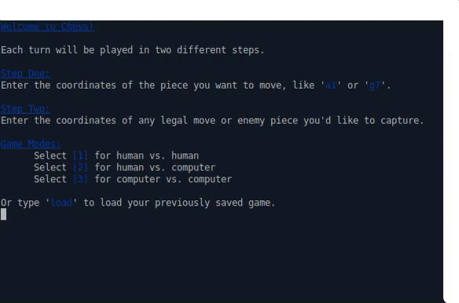

# Chess
This has been a long and challenging project. It took me two and a half months to complete, but I am so proud to have finished. The journey was full of ups and downs, and it often felt like taking two steps back to take three steps forward.

While I can say that this program was built from scratch, I would also like to recognize that I could not have done it without <strong>The Odin Project</strong> community <strong>Discord</strong> server. Their help genuinely made all the difference, and for that I am endlessly grateful!

### Video Demo

### Functionality

* Game Modes
  * Human vs. Human
  * Human vs. Computer
  * Computer vs. Computer
* Colorized Chess Board
* Players move pieces using coordinates like 'a1' or 'e5'
* Red dots indicate legal moves
* Enemy pieces that can be captured have a red background
* When an enemy piece is captured, it gets added to your graveyard
* Illegal moves tell you why they're illegal
* Once a piece is selected, it can be unselected
* The game can be saved to JSON at the beginning of a player's turn
* Upon starting the game, the old, saved game can be loaded
* Full check and Checkmate detection
* Asks for rematch and will replay from the beginning

### Other Features of the Code

* The Piece class makes use of the <strong>Template Method Design Pattern</strong>
* The Cell class makes use of the Null Object Design Pattern
* <strong>Factories</strong> are used for piece creation
* Slight <strong>polymorphism</strong> is used for the different game modes

### Things to Add Later

* Castling
* En Passant
* Pawn promotion
* Other fancy game moves

### The Biggest Challenge
By far, the biggest challenge was wrapping my mind around <strong>Object Oriented Design priciples</strong>. At first, I tried to write my Ruby code the same way I had written my procedural Javascript code. I thought I was close to the end of the project when I was able to move pieces, but I got stuck because my classes were so jumbled up.

When I went to the TOP Discord multiple great folks said that my program was <strong>begging</strong> for more classes and my classes were <strong>begging</strong> to be smarter. I think I had <strong>five classes</strong> handling <strong>EVERYTHING</strong>. That's when someone mentioned that they had <strong>over thirty classes</strong> in their solution to Chess. Obviously I was doing something inefficiently.

This is when I had to swallow my urge to plow forward. I had read about half of <em>Practical Object Oriented Design Principles</em> by <strong>Sandi Metz</strong> months before getting stuck, and I thought I knew OOP because I understood how <strong>messages</strong> worked between classes. Then someone told me <em>99 Bottles of OOP</em> by <strong>Sandi Metz</strong> might help. <strong>And It did!</strong>

99 Bottles made me realize that <strong>polymorphism was perhaps the most magical aspect of OOP.</strong> I also realized that I knew <strong>NOTHING</strong> about it! So, I read and worked alongside the book for a week or two, then got back to work. It took a few chats on Discord to understand how to apply this new knowledge to my Chess project. However, once the ball was rolling, <strong>I took off</strong>.

I was able to apply the <strong>Template method</strong> to my Piece class hierarchy, and it felt great! I was also able to use <strong>design paterns and polymorphism</strong> in some other places. I must admit that I do not consider myself a master of design patterns and polymorphism. However, what this taught me was that <strong>there really is magic to OOP.</strong>

Moving forward in my OOP education, I have another book called <em>Head First Design Patterns</em> by <strong>Eric Freeman</strong> &amp; <strong>Elisabeth Robson</strong> that goes over these inspiring design patterns in much more depth and detail.

### In Conclusion

This was a humbling and massively beneficial project that I don't know if I'll <strong>ever</strong> forget. This was a tough project to cut my teeth on, but I look forward to returning to this game when I have far more experience.
